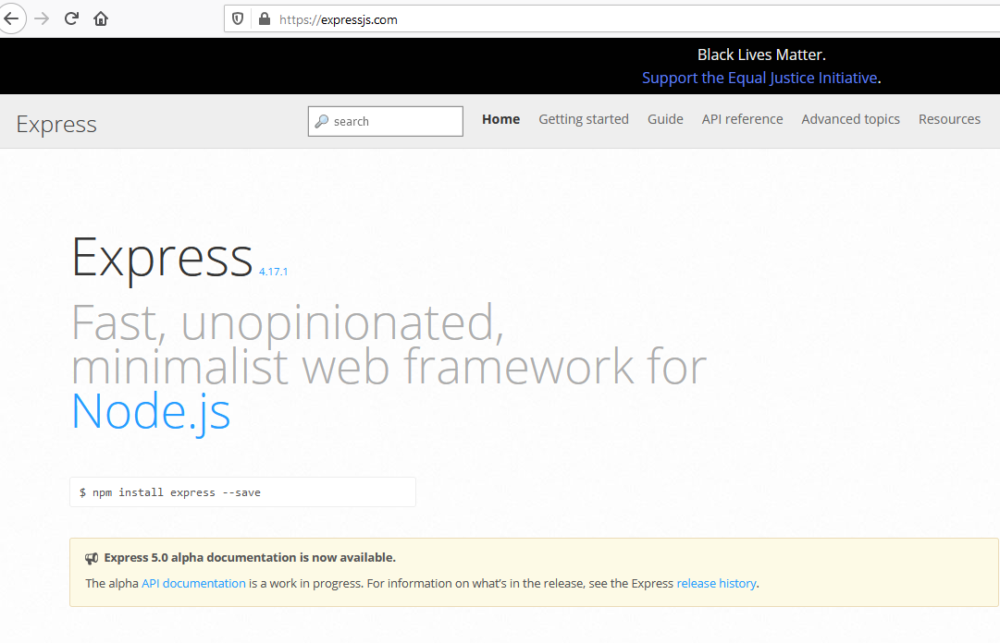
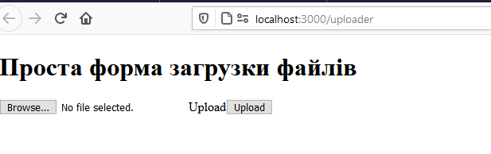
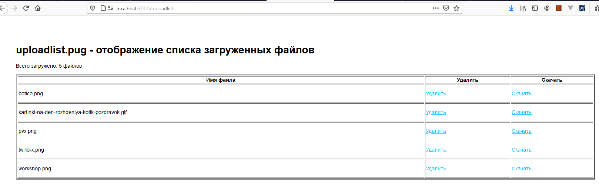

#  Классическое  Node.js express  приложение 


<!-- TOC BEGIN -->
- [Цель лабораторной работы](#p1)
- [Установка необходимых компонетнтов](#p2)
- [Описание приложеня и API](#p3)
- [Запуск в режиме debug](#p4)


    - [Установка Visual Studio Code](#p4)
- [Генерация шаблонного Node.js express приложения](#p5)

- [Поместить исходный код в локальный Git-репозиторий](#p6)
- [Отправить исходный код в  remote Git-репозиторий](#p7)


<!-- TOC END -->

<a name="p1"></a>
###  Цель  лабораторной работы

Эта лабораторная работа преследует такие цели:
 - ознакомиться с шаблоном приложения express.
 - Найчиться писать роутеры express  и их обработчики 
 - получить понятие  об асинхронных вызовах и понятие о callback

Express шаблон является одним из наиболее популярных  для написания backend -  обрабочиков и серверных решений. Он хорошо контейнеризируется и испоьзуется во всех облачных платформах. Документация по проекту: [express documentation](https://expressjs.com)

<kbd></kbd>
<p style="text-align: center;">l-01-pic-1</p>


<a name="p2"></a>
## Установка приложения

- Выполнить git clone [https://giturl]

- проинсталлировать зависимости

```bash

    npm install

```

- Создать workspace
Workspace  представляет собой json-файл  с расширением ".code-workspace ". Как мниму там можно указать каталог (или каталоги) проекта. Документация по линку: 
https://code.visualstudio.com/docs/getstarted/settings#_creating-user-and-workspace-settings

В реальности, для этого проекта: 
-- файл lab-01.code-workspace  

```json

    {
      "folders": [
        {
          "path": "./lab-01"
        }


      ]
    }

```


- запустить приложение локально

```bash
  npm start
```

Приложение запускает по порту 3000

В броузере нужно запустить:

```bash
   
   http://localhost:3000/

```

<a name="p3"></a>
## Описание приложеня

Это приложение демонстрашка, которая показывет, как писать http  роутеры и их обработчики для express приложения. В стандартном шаблоне там сомтреть нечего. Поэтому написано небольшое API  по работе с файлами. А за компанию и реализован и протой UI  на серврено шаблоне по генерации html страниц, который называенися PUG.


- по url http://localhost:3000/   доступен  роутер по умолчанию, который посталяется в проекте. Отсветится страничка ./view/index.pug

- по url http://localhost:3000/uploader отсвечивается формочка по загруке файлов
<kbd></kbd>
<p style="text-align: center;">l-01-pic-2</p>

За отсвечивание странички отвечает роутер: ./routers/uploadform.js.  Сама форма описана в файле ./view/uploadfile.pug. По кнопке upload форма генерирует метод http-post по локальному поти "/upload": 

```text
<form id="uploadForm" enctype="multipart/form-data" action="upload" method="post">

```

Обработчик http-post находится в роутере: **uploadapi.js**

```js

/** 
 *  API загрузка файла на сервер
*/
router.post('/', function(req, res, next) {
  
});

```

- по url http://localhost:3000/uploadlist  отсвечивается страничка с таблицой, в которой отсвечивается список занруженных файлов и есть кнопки для скачивания выбранного файла и удаления выбранного файла.
<kbd></kbd>
<p style="text-align: center;">l-01-pic-3</p>

Для реализации функции удаления и скачивания реализован специфичкский API в **uploadapi.js** и описан ниже.

- API  по удалению файла
Доступен по URL  http://localhost:3000/upload/:filename
Метод http:  delete
В качестве параметра в url передается имя файла [:filename]

```js
router.delete('/:filename', function(req, res, next) {

  return  flsrvc.FileDelete(req,res);
});

```

Заспрос delete не имеет дела

Ответ-OK: 
http-status=200
```json
{  ok: true, message: filename + ' успешно удален!'}    

```

Ответ-Err
http-status!=200

```json
{ok: false, error: err.message}

```

- API по получению списка загруженных файлов

Доступен по URL  http://localhost:3000/upload/
Метод: http-get

```js
    /** 
     *  API Получить список всех файлов в виде JSON
     *  @returns OK {"ok":"true","filelist":["CAs.Test.json","health.js","index.js","public.js","SchemaRouter.js"]}
     *  @returns ERR {ok: false, code: 500, error: err.message}
    */
    router.get('/', function(req, res, next) {

        return  flsrvc.FileList(req,res, next);
    });
```

- API по получению скачиванию отдельного файла

Доступен по URL  http://localhost:3000/upload/:filename
Метод: http-get

В отличие от предыдущего метода, в URL  добавляется  сегмент-параметр с именем файла [:filename].

```js
    router.get('/:filename', function(req, res, next) {

      return  flsrvc.FileDownload(req,res);
    });
```

<a name="p4"></a>
## Запуск в режиме debug

Не написал еще!