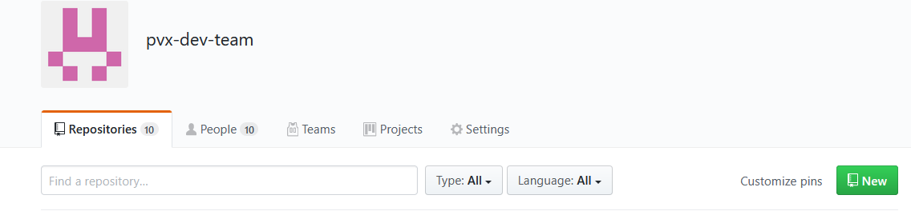
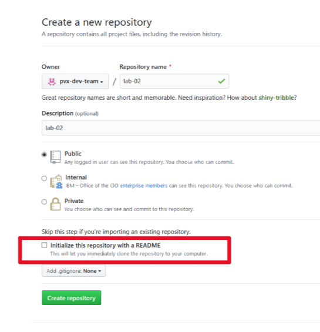
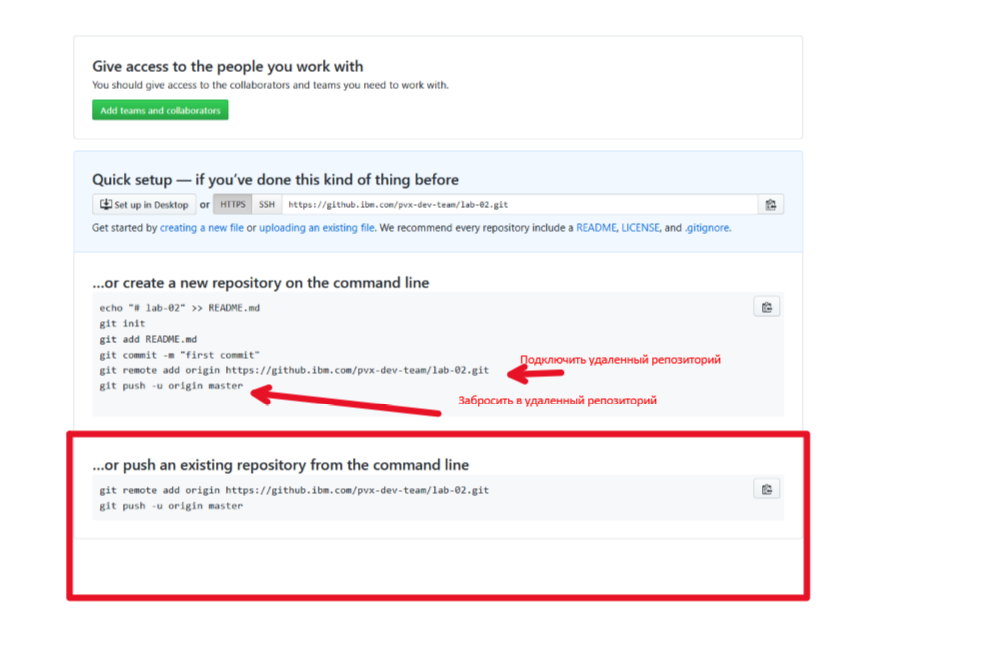
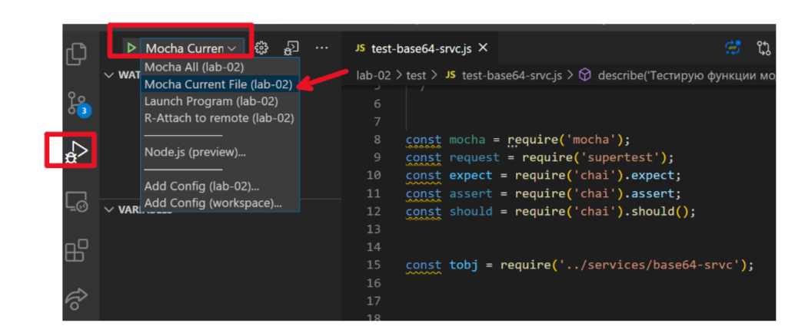

#  Классическое  Node.js express  приложение 


<!-- TOC BEGIN -->
- [Цель лабораторной работы](#p1)
- [Заброс кода в git и github](#p2)
- [Разработка основного класса](#p3)
- [Запуск в режиме debug](#p4)


<!-- TOC END -->

<a name="p1"></a>
###  Цель  лабораторной работы

Эта лабораторная работа преследует такие цели:
 - Рзработать express-сервис бо кодированию/декодированиб строки в base64.
 - Показать еще один  щаблон разработки класса - набора функций в Node.js 
 - Показать пример отладки класса через принципы test-driven development
 - создать  новый репозитрий и закинуть его в github


<kbd></kbd>
<p style="text-align: center;">l-01-pic-1</p>


<a name="p2"></a>
## Заброс кода в git и github 

На даном этапе у нас уже есть исходные код приложения. Теперь нужно забрость этот код в github. Для этой цели нужно выполнить такие шаги.

- Создать локальный git-репозиторий

```bash
   git init
      
```

- выполнить первый коммит readme.md

Для этого нужно выполнить команду:

```bash
  git add readme.md
```
Этой командой поставили этот файл под контроль.

-  Нужно выполнить commit

```bash
  git commit -m "init commit"
```

- нужно создать репозиторий на github
<kbd></kbd>
<p style="text-align: center;">pic-01</p>

<kbd></kbd>
<p style="text-align: center;">pic-02</p>

- Подключить удаленный репозиторий

<kbd></kbd>
<p style="text-align: center;">pic-03</p>

git remote add origin https://github.ibm.com/pvx-dev-team/lab-02.git

при этом нужно подставить свои параметры подключения. 

и потом выполнить 

``` bash
  git push -u origin master
```  

Дальше можно работать нормально с репозиторием.

<a name="p3"></a>
## Создание и отладка класса основного обработчика

Обычно разрабатывают отдельный класс-обработчик, потом его отлаживают и дальше его уже подключают к роутерам. Чтобы самому не писать тестовые классы придумали специальные инструменты для тестирования.

Основной обработчик написан в модуле **./services/base64-srvc.js**. Модуль содержит простые синхронные функции по кодированию и декодированию строки в base64. При этом дополнительно используется модуль обработки кастомных ошибок **./services/error/AppError.js**. 

Дальше, в модулях **routers/base64encodeRouter.js**, **routers/base64decodeRouter.js** уже написаны обработчики http - post запросов.


### Закодировавть строку в base64

Вызов выполняется по url **http://localhost:3000/b64encode.

- http заголовки

```text
    content-type: application/json
```

- тело запроса

```json

      { "msg": "Текс для кодирования в Base64"}
```

- успешный ответ

```json
    { "b64str": "0KLQtdC60YEg0LTQu9GPINC60L7QtNC40YDQvtCy0LDQvdC40Y8g0LIgQmFzZTY0"  }

```

- ответ с ошибкой

```json
    {"error_code": "server-error", "error_dsc": "В процессе обработки возникла ошибка"}

```


### Декодировавть строку из base64

Вызов выполняется по url **http://localhost:3000/b64decode.

- http заголовки

```text
    content-type: application/json
```

- тело запроса

```json

      { "str": "0KLQtdC60YEg0LTQu9GPINC60L7QtNC40YDQvtCy0LDQvdC40Y8g0LIgQmFzZTY0" }
```

- успешный ответ

```json
    
    { "str": "Строка, раскодированная из base64" }

```

- ответ с ошибкой

```json
    { "error_code": "valodation error", "error_dsc": " message" }
```

## Тестирование и отладка непосредственно функций

В каталоге test  находятся модули тестирования. 
- В файле **test-base64-srvc.js** находится тестовые кейсы по тестированию  и отладке непосредственно функций  кодирования и декодирования. Для инсталиирования тестовых библиотек нужно выполнить: 

```text
   
   npm install mocha
   npm install chai
   npm install supertest

```

А для интеграции с  VSC нужно выполнить настройики запуска приложений в файле: **./.vscode/launch.json** в разделе * "name": "Mocha Current File" *

```json

{
    // Use IntelliSense to learn about possible attributes.
    // Hover to view descriptions of existing attributes.
    // For more information, visit: https://go.microsoft.com/fwlink/?linkid=830387
    "version": "0.2.0",
    "configurations": [
    {
            "type": "node",
            "request": "launch",
            "name": "Mocha All",
            "program": "${workspaceFolder}/node_modules/mocha/bin/_mocha",
            "args": [
                "--timeout",
                "999999",
                "--colors",
                "${workspaceFolder}/test"
            ],
            "console": "integratedTerminal",
            "internalConsoleOptions": "neverOpen"
    }, 
    {
        "type": "node",
        "request": "launch",
        "name": "Mocha Current File",
        "program": "${workspaceFolder}/node_modules/mocha/bin/_mocha",
        "args": [
            "--timeout",
            "999999",
            "--colors",
            "${file}"
        ],
        "console": "integratedTerminal",
        "internalConsoleOptions": "neverOpen"
    },
        {
            "type": "node",
            "request": "launch",
            "name": "Launch Program",
            "program": "${workspaceFolder}\\server\\server.js"
        },

{
  "type": "node",
  "request": "attach",
  "name": "R-Attach to remote",
  "address": "localhost",
  "port": "8888",
  "localRoot": "${workspaceFolder}",
  "remoteRoot": "opt/app-root/src"
}


    ]
}

```

Как запустить отладчик из тестовых кейсов
<kbd></kbd>
<p style="text-align: center;">pic-04</p>


## Линк на полезные ресурсы
https://github.ibm.com/pvx-dev-team/materials/wiki/Node.js-test-tools-mocha%26chai
