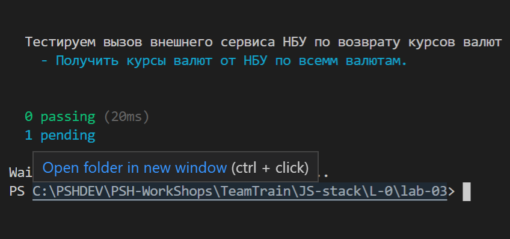
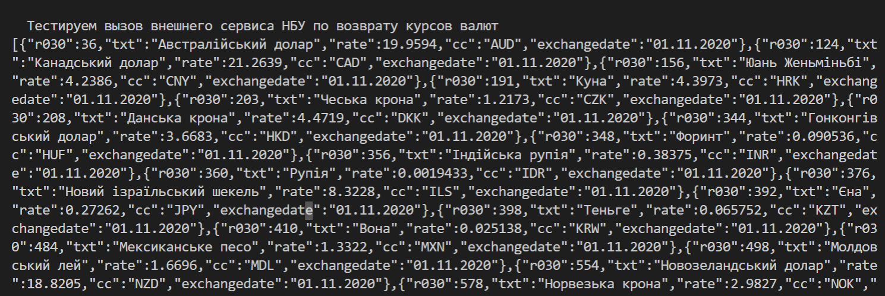

# lab-03 Создание простых http запросов

В современных условиях часто приходится работать с разными http сервисами. Т.е. наше приложение выступает агрегатором, которое использует внешние сервисы.
Для более глубокого понимания как работаю callback вызова, сделаем в даной лабораторной работе примеры использования внешних API.

Для создания внешних вызово используем библтотеку: [SuperAgent](https://github.com/visionmedia/superagent)  

## Superagent

Достаточно поплярный инструмент для  работами с другими http сервисами
- [SuperAgent](https://github.com/visionmedia/superagent)  
- [SuperAgent NPM-repo](https://www.npmjs.com/package/superagent)

Эта библиотека используем обычные collback вызова, что позволяет легче понять, как с ними работать. 

Установка библиотеки:

```json

    npm install superagent
``` 

## Написание сервиса, который будет вызывать API NBU по получению курсов НБУ

Страница всех API НБУ находится по линку: [страница API НБУ](https://old.bank.gov.ua/control/uk/publish/article?art_id=38441973&cat_id=38459171#exchange).
Также, более детальная документация может быть получена на линку:
[ скачается pdf ](https://old.bank.gov.ua/doccatalog/document?id=72819047-)

Согласно данных документов:
- курс НБУ на заданную дату по всем валютам может быть получен http-get  запросом:
https://bank.gov.ua/NBUStatService/v1/statdirectory/exchange?date=20201101

Курс на дату (задається у форматі YYYYMMDD, де YYYY - рік, MM - місяць, DD - день):


Курс НБУ на заданную дату по всем валютам может быть получен http-get  запросом:
https://bank.gov.ua/NBUStatService/v1/statdirectory/exchange?valcode=EUR&date=20201101


Нужно написать сервис, который выполнит запрос в НБУ  на указанную дату, получит курсы по всем валютам и сохранит  результат в виде JSON-файла в определенном каталоге

Для начала работы с внешними сервисами хорошим правилом есть - написать тестовый кейс, который вызовет эти сервисы и проверит  наличие канала и работоспособность сервсиса.

###  Написать тестовый кейс, который вызовет сервсис НУБ по получению курсов по всем валютам  на указанную дату.

Этот тестовый кейс находися в модуле **test/test-nbu-service.js**

- Подготовка пустого шаблона 
Изначально пустой шаблон имеет вид:

```js
/**
 * Тестирования вызова сервиса НБУ - напрямую
 */
  // подключнеие инструментов естирования
const mocha = require('mocha');
const request = require('supertest');
const expect = require('chai').expect;
const assert = require('chai').assert;
const should = require('chai').should();

// описание общего тестовго кейса
describe('Тестируем вызов внешнего сервиса НБУ по возврату курсов валют', function() {
      before(done => {
        // тут заглушка, так как нет кода
        // код, который должен выполниться перед началом тестовго кейса "describe" в целом      
        done();
      });
      it('Получить курсы валют от НБУ по всемм валютам.', function(done){
          // заглушка - пропуск тестового кейса 
          this.skip();
      }); //it 
      after(done => {
        // код, который должен выполниться после окончания тестовго кейса "describe" в целом      
        // тут заглушка, так как нет кода
        done();
    
      });
});
```

В результате запуска полчим такой лог:

<kbd></kbd>
<p style="text-align: center;">pic-01</p>


-  Подготовка http-запроса в it( ..... )

В запросе видим,что обмен выполняется по протоколу https. Следовательно, нужно подулчить сецифический модуль

```js

// доп. библиотеки для поддрежки обмена
//var http = require('http');
var https = require('https');

```

А в самом тесте: 

```js
      it('Получить курсы валют от НБУ по всемм валютам.', function(done){
          // заглушка - пропуск тестового кейса 
          //this.skip();
          // url=https://bank.gov.ua/NBUStatService/v1/statdirectory/exchange?date=20201101&json
          var l_date = '20201101';
          request('https://'+'bank.gov.ua')
          .get('/NBUStatService/v1/statdirectory/exchange')
          .query({date: l_date, json: null})
          .set('Accept', 'application/json')
          .set('Content-Type', 'application/json')
          .expect('Content-Type', 'application/json')
          .expect(200)
          .end(function(err, res) {
              if (err) {
                  console.log(err.message);
                  done(err);
              } else {
                  console.log( JSON.stringify(  res.body  )  );
                  done();
              }    
          });
      }); //it 
```

Особенности написния http - это механизм задания парамтеров в виде json-обьекта
В строке URL:  url=https://bank.gov.ua/NBUStatService/v1/statdirectory/exchange?date=20201101&json

В запроса: 

```js
.query({date: l_date, json: null})

```

В даном случае этот тест контроллирует только возврант успешного http-ответа

```js
          .expect('Content-Type', 'application/json')
          .expect(200)
```

Ну и ниже показан результат выполнения теста
<kbd></kbd>
<p style="text-align: center;">pic-02</p>

Цель достигнута - ответ получен.

###  Написать сервисный модуль для вызова API НБУ.

### функция getExchRateByDate
На вход принимает дату в формате 
Функция должна полчить  ответ от сервиса НБУ и записть результат в файл с именем 'exchrate-YYYYMMDD.JSON'.

Сервисный модуль создан в **./services/nbu-exch-srvc.js**
В модуле есть одна функция: **getExchRateByDate**
На вход она получает json обьектв в виде параметров:

```js
     a_param = {exchdat: '2020-11-01'}

```
**exchdat** - указыввет на дату, за котороу нужно получить курс

Возвразает функция:
- в случае успеха

возвращает json с двумя полями: ok, filename

```json
   {"ok": true, "filename": "a_param.filename"};
```

- в случае ошибки

 throw new apperror.ServiceError

Отладка и тестирование этой функции выполняется через тестовый модуль: **./test/test-nbu-exch-srvc.js**. В даном случае вызываем только этот обьект и не запускаем все приложение.


### Разработка http-роутера

Теперь нужно выставить наш сервис чекрез API для использования другими сервисами

Для этого разработан роутер: **./router/exchrateldr.js**, ему соответствует тестовый кейс: **./test/test-nbu-srvc-api.js**
В даном тестовом кейсе уже перед выполнением запускается и express приложение.

Запрос: 
**Метод: http-get**
**URL=http://localhost:3000/exchldr?date=2020-10-28**
**Headers**

```text
'Content-Type': 'application/json
```

Ответ:

```json
   {"ok": true, "filename": "exch20201029.json"}
```

