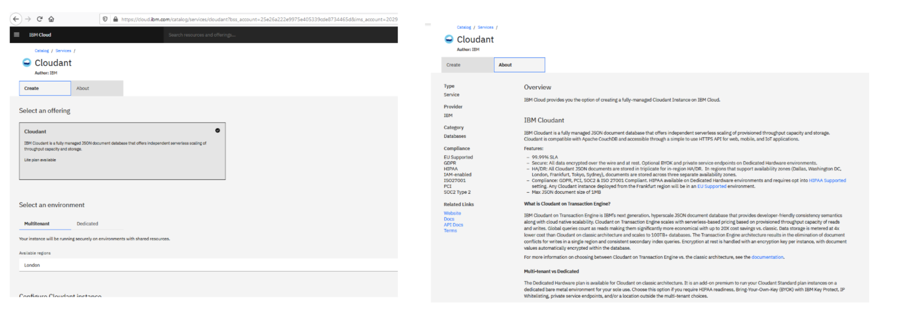
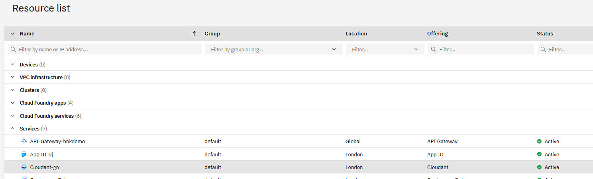
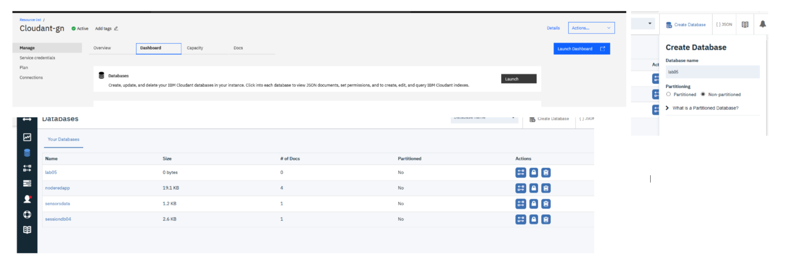
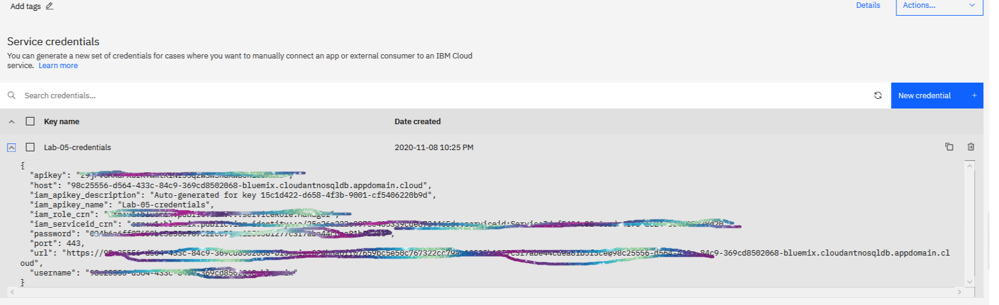
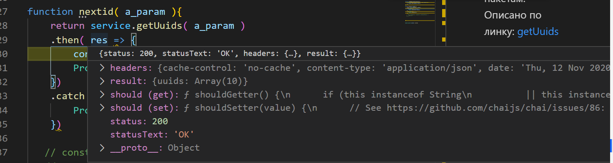

# lab-05 Работа с SDK на примере работы с NoSql БД Cloudant в IBM-Cloud


## Создание сревиса

[Линк на документацию IBM](https://cloud.ibm.com/docs/Cloudant?topic=Cloudant-getting-started-with-cloudant#getting-started-with-cloudant)

- найти в каталоге

<kbd></kbd>
<p style="text-align: center;">pic-01</p>

- запустить создание

<kbd></kbd>
<p style="text-align: center;">pic-02</p>


- Создать базу данных

<kbd></kbd>
<p style="text-align: center;">pic-03</p>

## Линки на SDK

[Documentation Node.js SDK](https://cloud.ibm.com/apidocs/cloudant?code=node#introduction)


[git hub cloudant-node-sdk](https://github.com/ibm/cloudant-node-sdk)


## Дополнительные библиотеки

Необходимо установить библиотеку-SDK  для Node.js

```
   npm install --save @ibm-cloud/cloudant
```

Необходимо читать и хранить конфигурацию  подключений. Для этого будем использовать тоже [специальный пакет IBM ibm-cloud-env ](https://www.npmjs.com/package/ibm-cloud-env)

```
    npm install ibm-cloud-env
```
## Создание credantials в облаке

Ну, ту нужно сгенерировать права для доступа из внешних программ


<kbd></kbd>
<p style="text-align: center;">pic-04</p>

Тут секретные данные закрашены. Не коммитте эти файлы в git.

Перечень  переменных-параметров описана в config/mappling.json

Для локального запуска, параметризация хранится в файле localdev-config.json.


## Подключение к БД

Для подключения к БД используем нстроечные параметры

./config/mappings.json

```json
{
  "version": 1,
  "url": {
    "searchPatterns": [
      "env:url",
      "file:/localdev-config.json:$.url"
    ]
  },
  "apikey": {
    "searchPatterns": [
      "env:apikey",
      "file:/localdev-config.json:$.apikey"
    ]
  },
  "host": {
    "searchPatterns": [
      "env:host",
      "file:/localdev-config.json:$.host"
    ]
  },
  "port": {
    "searchPatterns": [
      "env:port",
      "file:/localdev-config.json:$.port"
    ]
  },
  "username": {
    "searchPatterns": [
      "env:username",
      "file:/localdev-config.json:$.username"
    ]
  },
  "password": {
    "searchPatterns": [
      "env:password",
      "file:/localdev-config.json:$.password"
    ]
  }
}

```

В файле  опсианы параметры подключения БД, по сути, взятые со сгенеренного credentials
В разделе **"searchPatterns"**  описано 2 варианта доступа:
- **"env:password"**  -  пробуем прочитать переменную с переменных среды linux. Справделиво для любого контейнера

- **"file:/localdev-config.json:$.password"** - пробуем прочитать с локального файла
Файл в нашем случае находится в корне приложения localdev-config.json. 

В разделе [Programmatic authentication](https://cloud.ibm.com/apidocs/cloudant?code=node#introduction) показаны различные варианты подключенияк БД. В нашем случае используется межпрограммное взаимодейсвие. Поэтому использую вариант: 
**SDK managing the IAM token.**

Шаблон:

```js

const { CloudantV1 } = require('@ibm-cloud/cloudant');
const { IamAuthenticator } = require('ibm-cloud-sdk-core');

const authenticator = new IamAuthenticator({
    apikey: '{apikey}'
});

const service = new CloudantV1({
    authenticator: authenticator
});

service.setServiceUrl('{url}');
```

Пример имплементации: ./services/cloudant-srvc.js
Тестирование модуля нахоится в файле: ./test/test-cloudant-srvc.js

## Имплементация и тестирования функций работы с БД

Для работы с БД лучше начтаь работать с протстых функций, которые не требуют параметров. Пожтому начем с функции встроенной генерации id докумнета

### Получить один или несколько UUIDs
Используется для ненерации уникального id докумнета. можно генерировать пакетам. Описано по линку: [getUuids](https://cloud.ibm.com/apidocs/cloudant?code=node#getuuids)

**function nextid**

Входные  параметры:

{ count: 10 } - говорит, сколько UID сгенерироать. 

```json
   { count: 10 }
```

Из рис.-5  видно, что в качестве ответа SDK возвращает

<kbd></kbd>
<p style="text-align: center;">pic-05</p>

обычный  http ответ. Возвращаемая структура находится в поле result, а в  поле status соержится код ошибки.  Для нас 200 занчит OK.

### Создать документ в БД

API [service.postDocument](https://cloud.ibm.com/apidocs/cloudant?code=node#postdocument)

Прикладная функция docCreate


### Удалить документ в БД


### Выборка документов из БД

используется функция [postFind](https://cloud.ibm.com/apidocs/cloudant?code=node#postfind)

```js
import { CloudantV1 } from '@ibm-cloud/cloudant';
const service = CloudantV1.newInstance({});

const selector: CloudantV1.Selector = {
  email_verified: {
    '$eq': true
  }
};

const sort: CloudantV1.FieldSort = {
  name: 'desc'
};

service.postFind({
  db: 'users',
  selector: selector,
  fields: ['_id', 'type', 'name', 'email'],
  sort: [sort],
  limit: 3
}).then(response => {
  console.log(response.result);
});

```

у нас это функция: docSelect 
Результат работы функции есть массив {docs{}}, в котором содержаться документы


