# lab-07  Работа Node.js с очередями IBM MQ


## Создание в облаке IBM MQ 

В облачном каталоге, MQ  можно найти по рямому линку: https://cloud.ibm.com/catalog/services/mq


[Линк на документацию IBM MQ](https://cloud.ibm.com/docs/mqcloud/index.html)

- найти в каталоге

<kbd>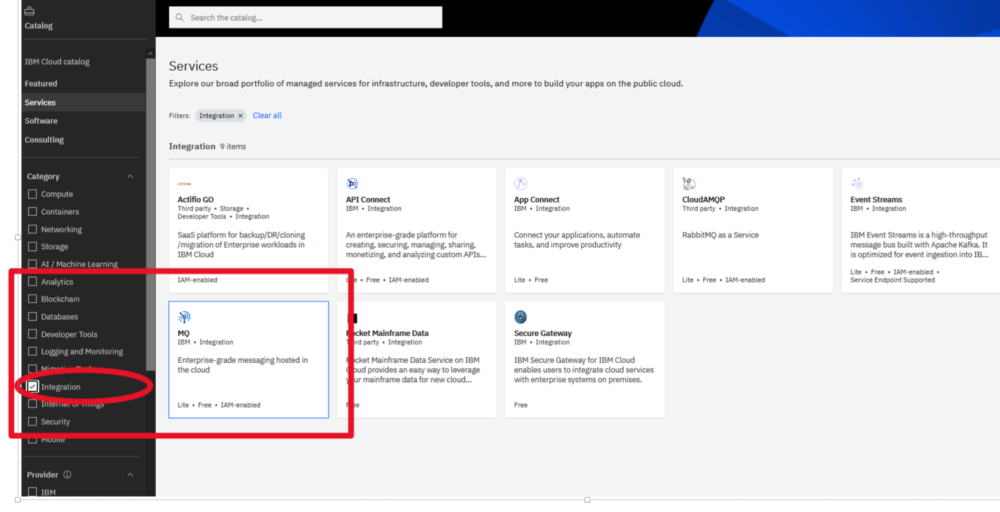</kbd>
<p style="text-align: center;">pic-01</p>

- запустить создание, выбрав  light plan

<kbd>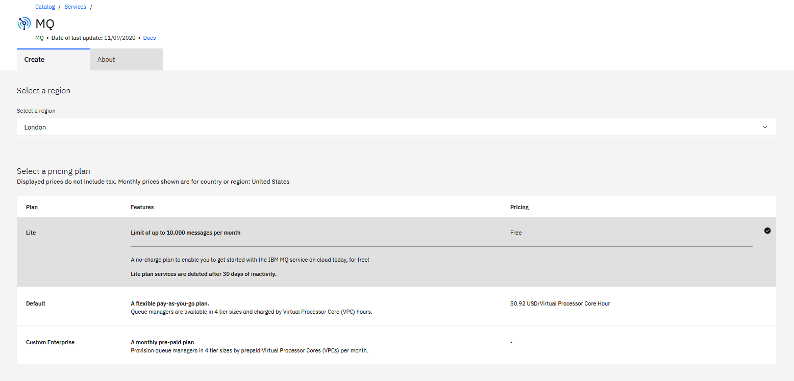</kbd>
<p style="text-align: center;">pic-02</p>


- Дождаться пока задеплоится сервис и перейдет в статус "Active"

<kbd>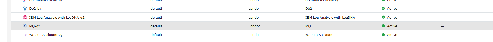</kbd>
<p style="text-align: center;">pic-03</p>

- Содать QM-manager и дождаться, когда он стартонет
<kbd>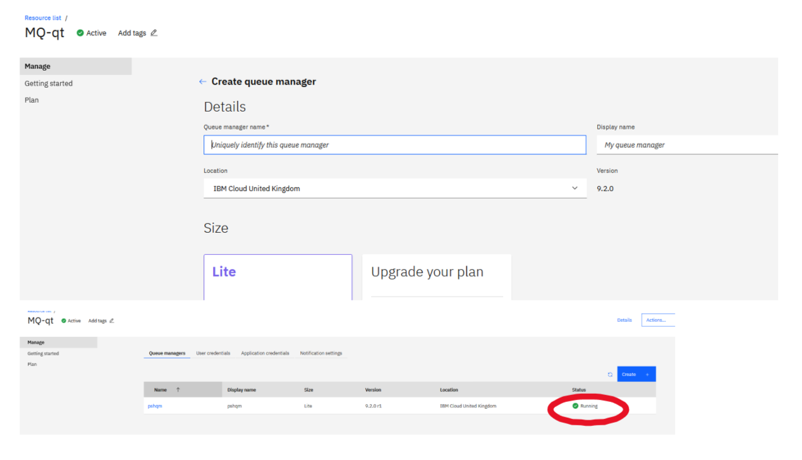</kbd>
<p style="text-align: center;">pic-04</p>


Все, сервис создан!

- Сгенерироать  административный API KEY  с скачать параметры подключения

<kbd>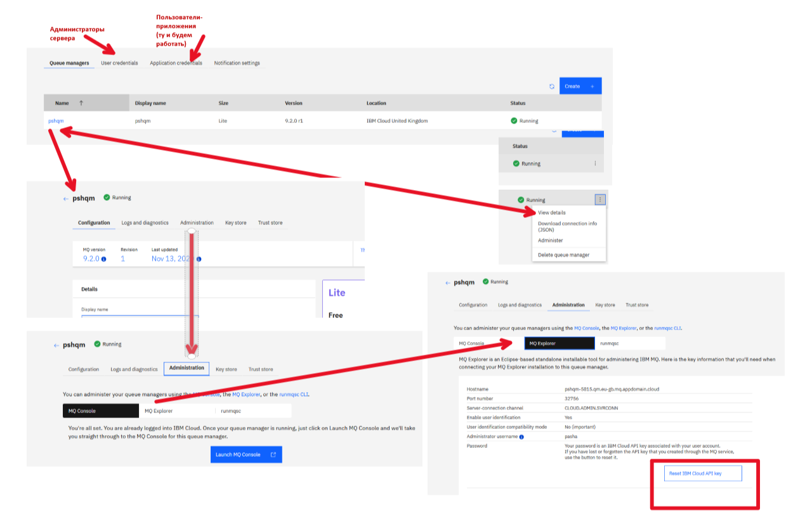</kbd>
<p style="text-align: center;">pic-05</p>

Скачать Connection-info

```json

{
 "platform": "ibmmq-on-cloud",
 "queueManagerName": "****",
 "hostname": "*******.qm.eu-gb.mq.appdomain.cloud",
 "listenerPort": 32***,
 "logPort": 30***,
 "applicationChannelName": "CLOUD.APP.SVRCONN",
 "adminChannelName": "CLOUD.ADMIN.SVRCONN",
 "deploymentLocation": "bmx-eu-gb",
 "webConsoleURL": "https://web-******.qm.eu-gb.mq.appdomain.cloud/ibmmq/console",
 "messagingREST": "https://web******.qm.eu-gb.mq.appdomain.cloud/ibmmq/rest/v1/messaging/qmgr/*****/queue/(queue_name)/message",
 "adminREST": "https://web-****.qm.eu-gb.mq.appdomain.cloud/ibmmq/rest/v1/admin/qmgr/******"
}

```

А, сгенерированный административный API KEY  выглядит так

```json
{
    "name": "MQ user key",
    "mqUsername": "*****",
    "description": "Automatically created api key for MQ usage",
    "createdAt": *****,
    "apiKey": "*********"
}
```

Это используется для досутпа к администрированию программными способами, на пример через REST API


- Перейти в раздел Appliction credentials и создать для своего придожения реквизиты подлючения. Их будем использовать при подключении приложения к серверу MQ

<kbd>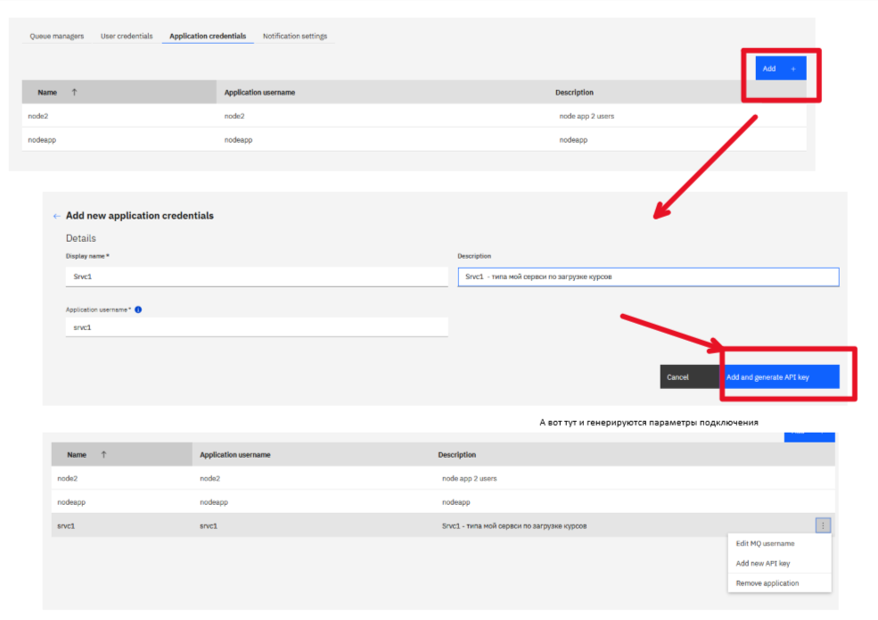</kbd>
<p style="text-align: center;">pic-06</p>


- Самы важный момент! зайти в настройку  коммуникационных каналов и доавить  параметры вашего приложения в канал

Найти каналы можно на риснке pic-7

<kbd>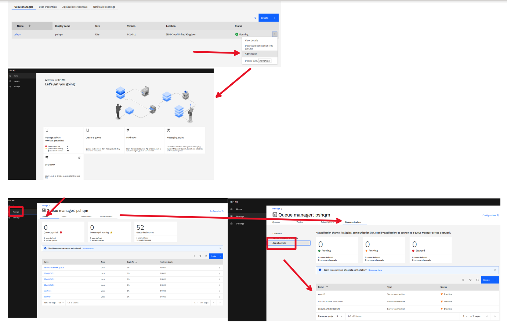</kbd>
<p style="text-align: center;">pic-07</p>

- Добавить пользователя вашего приложения, для доступа к каналу

<kbd>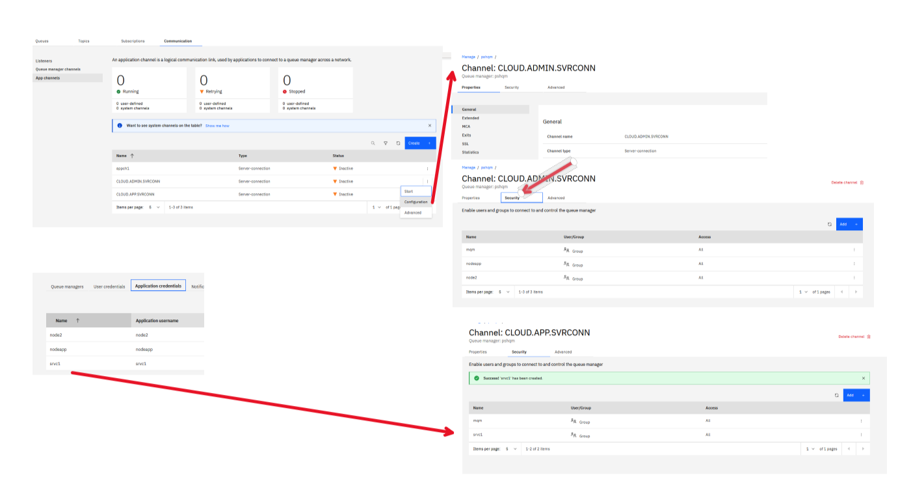</kbd>
<p style="text-align: center;">pic-08</p>

- Настройка закончена. Можем создать  необхожиме очередя и положить несколько тестовых сообщений в очередь

<kbd>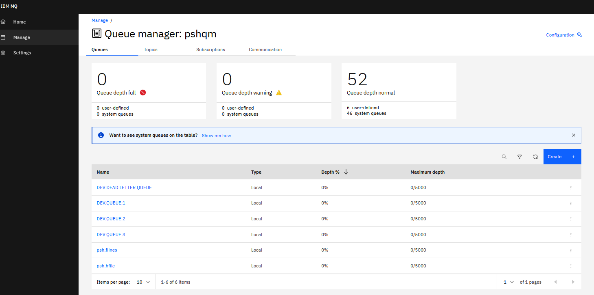</kbd>
<p style="text-align: center;">pic-09</p>


## Заметки по поводу Node.JS  библиотеки для работы с IBM MQ

C  IBM MQ on-premise можно подлючастья по
- "родному" протоколу
- по MQTT  протоколу
- по MQ-Light  протоколу
- по Rest API

В облачной версии нашел только 2:

- "родной" протокол
- Rest API

В https://github.com/ibm-messaging/mq-mqi-nodejs представлена библиотека.  Там много и дургих библиотек.
В npm репозитории нужно искать:
[mq-mqi-nodejs](https://www.npmjs.com/package/ibmmq)
Библиотека  обновлялась 4 месяца назад под новую версию MQ.

Для MQTT протокла можно использовать библиотеку:
[MQTT.js](https://www.npmjs.com/package/mqtt)
[MQ-Light](https://www.npmjs.com/package/mqlight)

Но, эти библиотеки нужно изучать еще

## Описание модуля по работе с IBM MQ  по  "родному" протоколу

Для работы с MQ написан модуль **./services/imq-srvc.js**, который имеет 3 класса:

- **MQBase** - базовый класс, который обеспечивае вычитку конфыгурации и подключение/отключение к MQ-manager, и несколько сервисных функций.

- **MQSender** - расширение **MQBase** функциями  для отправки сообщения в очередь


- **MQReciever** - расширение **MQBase** функциями для синхронного чтения сообщений из очереди.

Для работы класса используются такие конфигурационные параметры **localdev-config.json** :

```json
    {
    "mq_qm":  " Имя MQ manager",
    "mq_host":" Хост для подключения ",
    "mq_port": "Порт  для подключнеия",
    "mq_channel": "Канал для подключения",
    "mq_username": "Application username  для подклчения к каналу",
    "mq_apikey": " apikey для подключения к приложению"
    }  
```  

**(./config/mappings.json)**

```json
{
  "version": 1,
        "mq_qm": {
            "searchPatterns": [
            "env:mq_qm",
            "file:/localdev-config.json:$.mq_qm"
            ]
        },
        "mq_host": {
            "searchPatterns": [
            "env:mq_host",
            "file:/localdev-config.json:$.mq_host"
            ]
        },
        "mq_port": {
            "searchPatterns": [
            "env:mq_port",
            "file:/localdev-config.json:$.mq_port"
            ]
        },
        "mq_channel": {
            "searchPatterns": [
            "env:mq_channel",
            "file:/localdev-config.json:$.mq_channel"
            ]
        },
        "mq_username": {
            "searchPatterns": [
            "env:mq_username",
            "file:/localdev-config.json:$.mq_username"
            ]
        },
        "mq_apikey": {
            "searchPatterns": [
            "env:mq_apikey",
            "file:/localdev-config.json:$.mq_apikey"
            ]
        }
}

```

В каталоге **./test** находятся 2 тестовых файла:
- **test-imq-srvc-send.js**  отправка сообщений в очередь
- **test-imq-srvc-recieve.js** синхронное чтение сообщений из очереди.

Последовательность отправки сообщений:

- подключить модуль и создать класс

```js
// подключаем модуль 
var xsrvc = require('../services/imq-srvc');
var srvc = new xsrvc.MQSender();
```


- *mq_connect*  подключиться к MQ-менеджеру
- *mq_openq*    подключиться к очереди (к обьекту MQ-менеджера )

- *mq_putMessage* отправить сообщение в очередь (тут можно в цикле)

- *mq_closeq* отключиться от очереди (от  обьекта MQ-менеджера)
- *q_disconnect* отключиться от MQ-менеджера


Последовательность при чтении сообщений:

- подключить модуль и создать класс

```js
// подключаем модуль 
var xsrvc = require('../services/imq-srvc');
var srvc = new xsrvc.MQReciever();
```


- *mq_connect*  подключиться к MQ-менеджеру
- *mq_openq*    подключиться к очереди (к обьекту MQ-менеджера )

- *mq_getMessage* Синхронное чтение сообщения и очереди

- *mq_closeq* отключиться от очереди (от  обьекта MQ-менеджера)
- *q_disconnect* отключиться от MQ-менеджера


## Результаты прогона тестовы

### Отправка сообщения

```text


  Тестируем модуль imq-srvc
mq_connect=start
mq_connect: Подключаюсь!
mq_connect: OK=Подключились
{"_hConn":2113929221,"_name":"pshqm"}
    √ function mq_connect - подключиться к серверу (1489ms)
mq_openq: OK=подключились
i_hObj={"_hObj":101,"_mqQueueManager":{"_hConn":2113929221,"_name":"pshqm"},"_name":"DEV.QUEUE.1"}
    √ Открыаю очередь для записи сообщений (224ms)
mq_putMessage: mqmd before send {"Report":0,"MsgType":8,"Expiry":-1,"Feedback":0,"Encoding":1208,"CodedCharSetId":1208,"Format":{"type":"Buffer","data":[32,32,32,32,32,32,32,32]},"Priority":-1,"Persistence":2,"MsgId":{"type":"Buffer","data":[0,0,0,0,0,0,0,0,0,0,0,0,0,0,0,0,0,0,0,0,0,0,0,0]},"CorrelId":{"type":"Buffer","data":[0,0,0,0,0,0,0,0,0,0,0,0,0,0,0,0,0,0,0,0,0,0,0,0]},"BackoutCount":0,"ReplyToQ":null,"ReplyToQMgr":null,"UserIdentifier":null,"AccountingToken":{"type":"Buffer","data":[0,0,0,0,0,0,0,0,0,0,0,0,0,0,0,0,0,0,0,0,0,0,0,0,0,0,0,0,0,0,0,0]},"ApplIdentityData":null,"PutApplType":0,"PutApplName":null,"PutDate":null,"PutTime":null,"ApplOriginData":null,"GroupId":{"type":"Buffer","data":[0,0,0,0,0,0,0,0,0,0,0,0,0,0,0,0,0,0,0,0,0,0,0,0]},"MsgSeqNumber":1,"Offset":0,"MsgFlags":0,"OriginalLength":-1}
mq_putMessage: Отправляю сообщение в очередь
mq_putMessage: mqmd after send {"Report":0,"MsgType":8,"Expiry":-1,"Feedback":0,"Encoding":1208,"CodedCharSetId":1208,"Format":"MQSTR","Priority":-1,"Persistence":2,"MsgId":{"type":"Buffer","data":[65,77,81,32,112,115,104,113,109,32,32,32,32,32,32,32,216,198,174,95,2,252,207,35]},"CorrelId":{"type":"Buffer","data":[65,77,81,32,112,115,104,113,109,32,32,32,32,32,32,32,216,198,174,95,3,252,207,35]},"BackoutCount":0,"ReplyToQ":"","ReplyToQMgr":"","UserIdentifier":"nodeapp","AccountingToken":{"type":"Buffer","data":[22,1,5,1,0,0,0,224,58,159,69,168,137,188,65,182,120,106,200,73,245,34,85,0,0,0,0,0,0,0,0,12]},"ApplIdentityData":"","PutApplType":11,"PutApplName":"rogram Files\\nodejs\\node.exe","PutDate":"20201115","PutTime":"20482687","ApplOriginData":"","GroupId":{"type":"Buffer","data":[0,0,0,0,0,0,0,0,0,0,0,0,0,0,0,0,0,0,0,0,0,0,0,0]},"MsgSeqNumber":1,"Offset":0,"MsgFlags":0,"OriginalLength":-1}
mq_putMessage: OK= MsgId=414d5120707368716d20202020202020d8c6ae5f02fccf23
mq_putMessage: OK= Отправил!!!
{"msgid":"414d5120707368716d20202020202020d8c6ae5f02fccf23"}
    √ Послать в очередь 1 сообщение (142ms)
test\fls\exch20201001.json
mq_putMessage: mqmd before send {"Report":0,"MsgType":8,"Expiry":-1,"Feedback":0,"Encoding":1208,"CodedCharSetId":1208,"Format":{"type":"Buffer","data":[32,32,32,32,32,32,32,32]},"Priority":-1,"Persistence":2,"MsgId":{"type":"Buffer","data":[0,0,0,0,0,0,0,0,0,0,0,0,0,0,0,0,0,0,0,0,0,0,0,0]},"CorrelId":{"type":"Buffer","data":[0,0,0,0,0,0,0,0,0,0,0,0,0,0,0,0,0,0,0,0,0,0,0,0]},"BackoutCount":0,"ReplyToQ":null,"ReplyToQMgr":null,"UserIdentifier":null,"AccountingToken":{"type":"Buffer","data":[0,0,0,0,0,0,0,0,0,0,0,0,0,0,0,0,0,0,0,0,0,0,0,0,0,0,0,0,0,0,0,0]},"ApplIdentityData":null,"PutApplType":0,"PutApplName":null,"PutDate":null,"PutTime":null,"ApplOriginData":null,"GroupId":{"type":"Buffer","data":[0,0,0,0,0,0,0,0,0,0,0,0,0,0,0,0,0,0,0,0,0,0,0,0]},"MsgSeqNumber":1,"Offset":0,"MsgFlags":0,"OriginalLength":-1}
mq_putMessage: Отправляю сообщение в очередь
mq_putMessage: mqmd after send {"Report":0,"MsgType":8,"Expiry":-1,"Feedback":0,"Encoding":1208,"CodedCharSetId":1208,"Format":"MQSTR","Priority":-1,"Persistence":2,"MsgId":{"type":"Buffer","data":[65,77,81,32,112,115,104,113,109,32,32,32,32,32,32,32,216,198,174,95,4,252,207,35]},"CorrelId":{"type":"Buffer","data":[65,77,81,32,112,115,104,113,109,32,32,32,32,32,32,32,216,198,174,95,5,252,207,35]},"BackoutCount":0,"ReplyToQ":"","ReplyToQMgr":"","UserIdentifier":"nodeapp","AccountingToken":{"type":"Buffer","data":[22,1,5,1,0,0,0,224,58,159,69,168,137,188,65,182,120,106,200,73,245,34,85,0,0,0,0,0,0,0,0,12]},"ApplIdentityData":"","PutApplType":11,"PutApplName":"rogram Files\\nodejs\\node.exe","PutDate":"20201115","PutTime":"20482704","ApplOriginData":"","GroupId":{"type":"Buffer","data":[0,0,0,0,0,0,0,0,0,0,0,0,0,0,0,0,0,0,0,0,0,0,0,0]},"MsgSeqNumber":1,"Offset":0,"MsgFlags":0,"OriginalLength":-1}
mq_putMessage: OK= MsgId=414d5120707368716d20202020202020d8c6ae5f04fccf23
mq_putMessage: OK= Отправил!!!
{"msgid":"414d5120707368716d20202020202020d8c6ae5f04fccf23"}
    √ Послать в очередь 1 файл с курсами (167ms)
mq_closeq: OK=Соединение закрыто!
i_hObj= Откоючились
    √ Отключиться от обьекта ОЧЕРЕДЬ (99ms)
mq_disconnect: OK=отключились!
    √ Отключиться от  сервера MQ (267ms)


  6 passing (2s)

Waiting for the debugger to disconnect...

```

<kbd>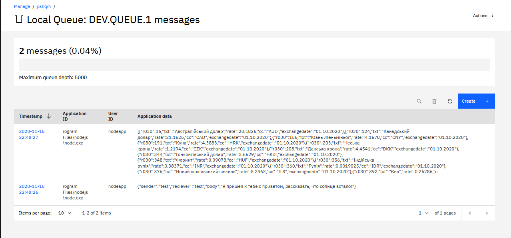</kbd>
<p style="text-align: center;">pic-10</p>


### Чтение из очереди

```text

Тестируем модуль imq-srvc
mq_connect=start        
mq_connect: Подключаюсь!
mq_connect: OK=Подключились
{"_hConn":2113929221,"_name":"pshqm"}
    √ function mq_connect - подключиться к серверу (1495ms)
mq_openq: OK=подключились
i_hObj={"_hObj":101,"_mqQueueManager":{"_hConn":2113929221,"_name":"pshqm"},"_name":"DEV.QUEUE.1"}
    √ Открыаю очередь для записи сообщений (143ms)
mq_getMessage: Читаю сообщение из очереди
{"mqmdhdr":{"msgid":"414d5120707368716d20202020202020d8c6ae5f02fccf23","corelid":"414d5120707368716d20202020202020d8c6ae5f03fccf23","format":"MQSTR","putdate":"20201115","encoding":1208,"CodedCharSetId":1208},"msg":{"sender":"test","reciever":"test","body":"Я пришел к тебе с приветом, рассказать, что солнце встало!"}}
    √ Прочитать из очереди сообщения (129ms)
mq_closeq: OK=Соединение закрыто!
i_hObj= Откоючились
    √ Отключиться от обьекта ОЧЕРЕДЬ (213ms)
mq_disconnect: OK=отключились!
    √ Отключиться от  сервера MQ (99ms)


  5 passing (2s)

Waiting for the debugger to disconnect.
```

<kbd>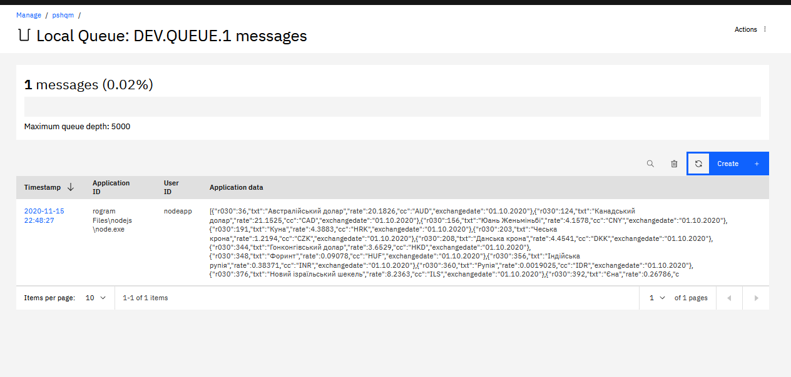</kbd>
<p style="text-align: center;">pic-11</p>
